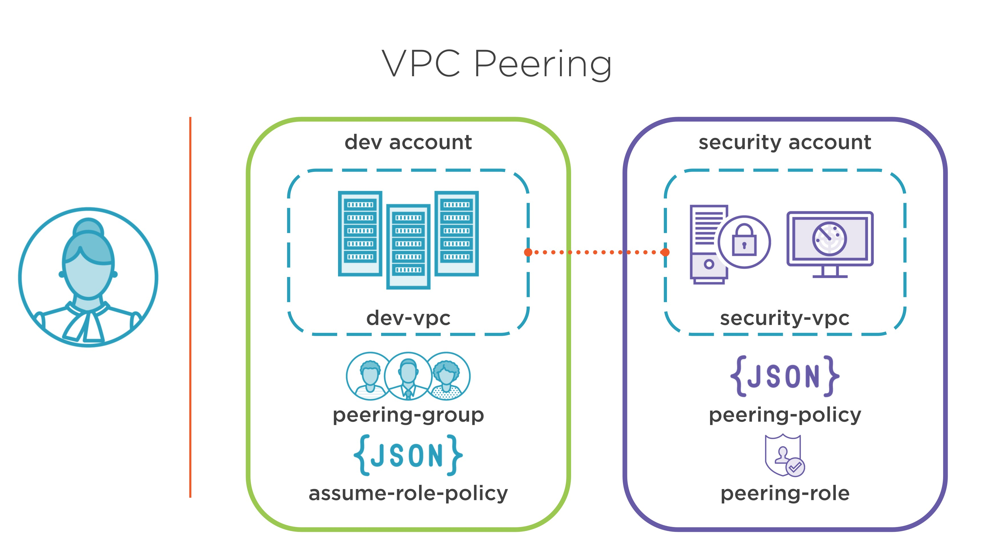
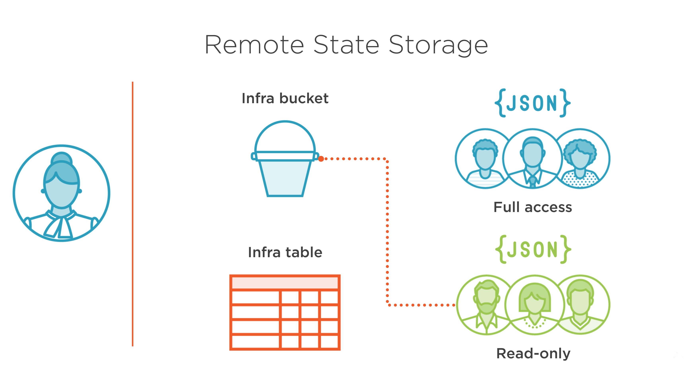
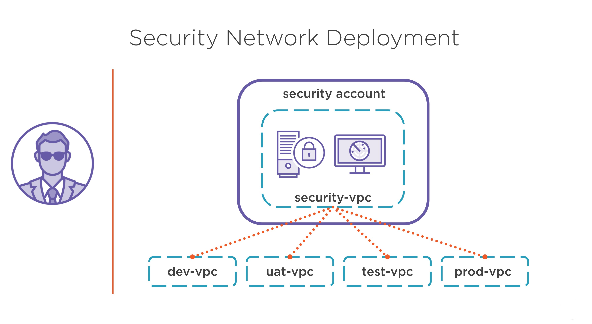
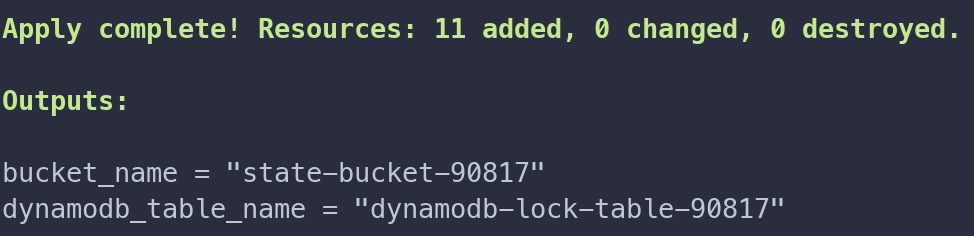
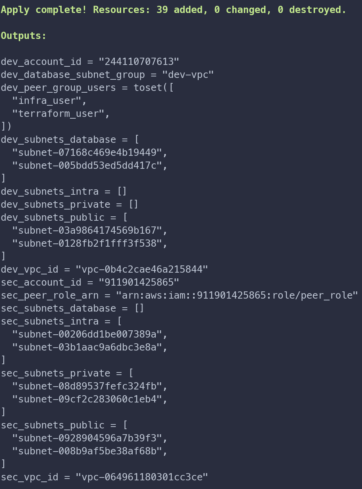
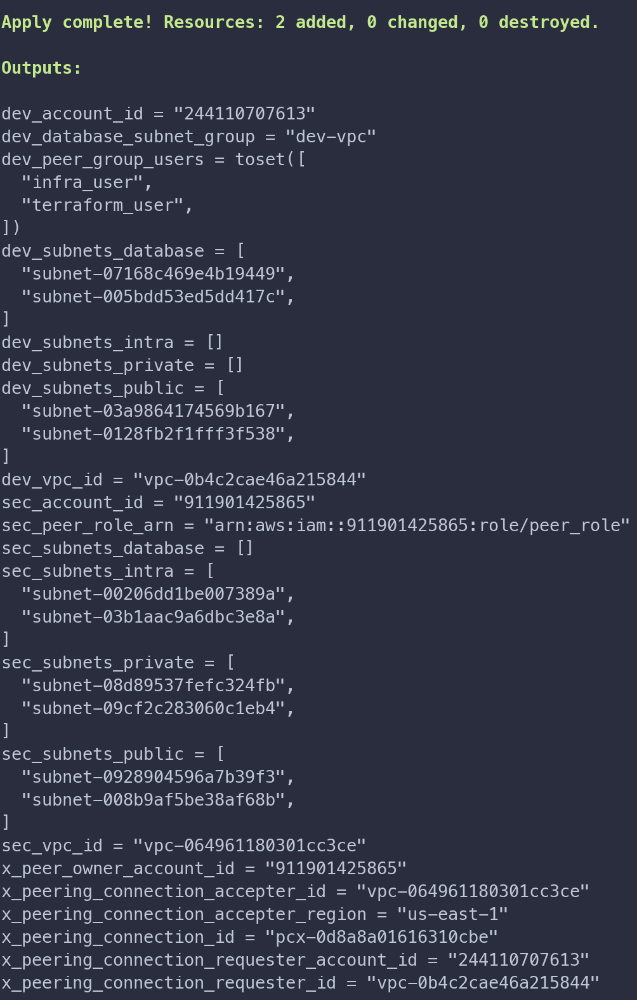
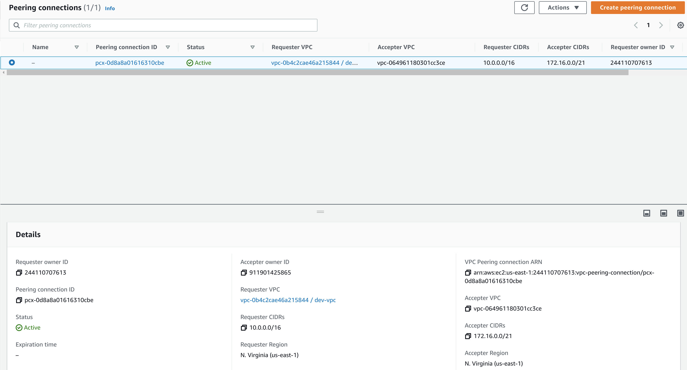
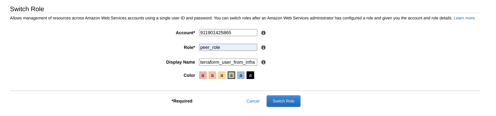
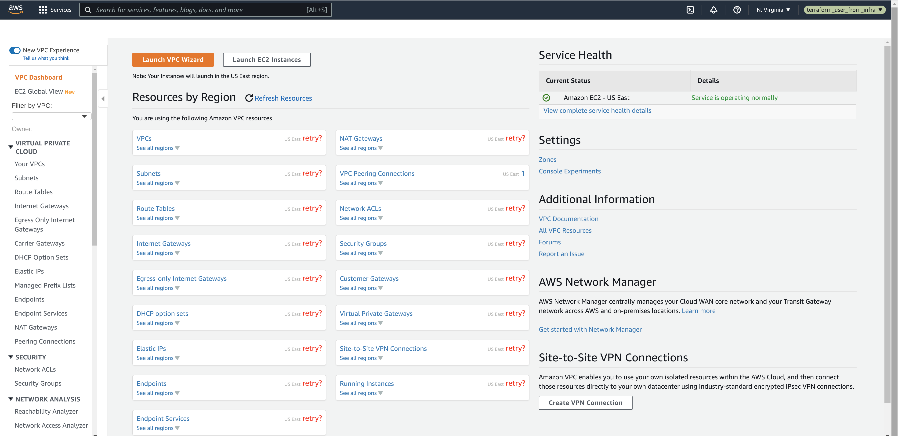

# Terraform with multiple AWS providers
Peering up two VPC in different AWS accounts via Terraform using multiple providers management
(aliases) and *AssumeRole*.
> :warning: Some of the resources deployed in AWS may cost money


## Prerequisites
* Two AWS accounts with admin permissions
* Two profiles for different AWS accounts:
    * **sec**
    * **infra**
* User for each AWS account
* Unix/Windows
* AWS CLI
* Terraform (~>1.1)
> :warning: **infra** account should not have permissions to the **sec** account by default

## Description
* AWS profiles usage:
    * **sec** for **security team** inspection
    * **infra** for infrastructure management
>
* AWS **S3 bucket** is used as the backend for Terraform state and **DynamoDB** for locking to prevents changes to do simultaneously (no concurrent updates)
  > :memo: **DynamoDB** does not support granual permissions
  

* Peering is used to connect VPC's from **infra** account with **sec** account VPC
  > :memo: Be peered with the security VPC new created **infra** VPC so **security team** can get their hooks into


## Installation
1. Configure **sec** and **infra** profiles for two different AWS accounts:
    ```sh
    aws configure
    ```
2. Authorize via environmental variable:
    ```sh
    export AWS_PROFILE=infra
    ```
    > :memo: Provide credentials to Terraform AWS provider via named AWS **infra** profile
3. Initialize the backend:
    ```sh
    cd 0_terraform_backend
    # Rename the file and specify existing users for read and full access to the S3 bucket
    cp terraform.tfvars.backup terraform.tfvars
    terraform init
    terraform plan -out "backend.tfplan"
    terraform apply "backend.tfplan"
    ```
4. Get **S3 bucket** name and **DynamoDB** table from the outputs:
   
   > :memo: Make a note of **bucket_name** and **dynamo_db_table_name** values for further action
5. Create main resources:
    ```sh
    cd ../1_terraform_main
    # Substitute the values from the backend outputs
    terraform init -reconfigure -backend-config="bucket=state-bucket-90817" -backend-config="region=us-east-1" -backend-config="dynamodb_table=dynamodb-lock-table-90817"
    # Rename the file and update peering_users list to delegate access to the security account to accept the peering connection on that security VPC
    cp terraform.tfvars.backup terraform.tfvars
    terraform plan -out "main.tfplan"
    terraform apply "main.tfplan"
    ```
   
6. Create and accept VPC peering connection between **dev** and **sec** VPCs:
    ```sh
    # Rename the file
    cp peering peering.tf
    terraform plan -out "peer.tfplan"
    terraform apply "peer.tfplan"
    ```
   
1. Check **VPC peering connection** from the AWS console
   
   
   
   
2. Destroy resources:
    ```sh
    # main
    terraform destroy -auto-approve
    # backend
    cd ../0_terraform_backend/ && terraform destroy -auto-approve
    ```
